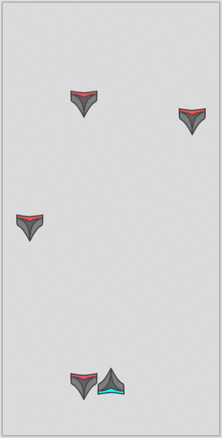

# Part Three: What About NPCs?
In this next step we will create a simple NPC. Three new classes and a couple of small changes to the `Highway` will be needed to achieve this.

## Factory
As before, we will implement a factory to handle the creation of our NPCs. The `NpcFactory` is very similar to the earlier shown `PlayerFactory` and is thus emitted. You can find its source at `demo/hello_world/part3/npc/npc_factory.ts`.

## Spawning
Second, a prop to control the spawning is needed. It will extend `PropBase` and write a `process` function. The function will then - based on some arbitrary logic - decide how and where the NPCs should spawn.

But first, let us create a helper class for `Lane` management:

```typescript
class Lane
{
  public position: number;
  public velocity: number;
  public cooldown: number;
  public lastItem: number;

  constructor(position: number, velocity: number)
  {
    this.position = position;
    this.velocity = velocity;
    this.cooldown = 1000 * (500 / velocity);
    this.lastItem = 0;
  }
}
```

Our `NpcSpawnProp` looks as follows:
```typescript
class NpcSpawnProp extends sczCore.PropBase
{
  private systems: sczCore.System[];
  private npcFactory: NpcFactory;
  private lanes: Array<Lane>;


  constructor(
    eventbus: sczCore.EventBus,
    systems: sczCore.System[],
    npcFactory: NpcFactory)
  {
    super(eventbus, sczCore.EngineEvent.PostComputation)
    this.systems = systems;
    this.npcFactory = npcFactory;

    // define possible lanes
    this.lanes = [
      new Lane(50,  100),
      new Lane(150, 150),
      new Lane(250, 150),
      new Lane(350, 200)];
  }

  public process(deltaTime: number): void
  {
    // spawn chance: on average once a second
    if(Math.random() * 1000 < deltaTime)
    {
      // spawn npc
      this.spawn();
    }
  }

  // spawns an npc in a random lane
  private spawn(): void
  {
    // place holder
  }
}
```
The spawning logic is implemented to choose a random lane as well as to respect a certain "safety distance" implement with a cool-down timer.

```typescript
...
// spawns an npc in a random lane
private spawn(): void
{
  // lane selection
  let laneNumber = Math.floor(Math.random() * this.lanes.length);
  let lane = this.lanes[laneNumber];

  // cooldown: max one spawn per lane per second
  let now = new Date().getTime()
  let delta = now - lane.lastItem;
  if(delta > lane.cooldown)
  {
    // reset cooldwon counter
    lane.lastItem = now;

    // create npc using a dedicated factory
    let id = Math.floor(Math.random() * 10**12);
    let position = {x: lane.position, y: -100};
    this.npcFactory.create(
      id,
      position,
      lane.velocity,
      this.systems);
  }
}
```

> It is considered best practice to implement one system per responsibility, each dedicated to their single and preferably simple task.

Following this practice a system concerned with the de-spawning is needed.
```typescript
class NpcDespawnSystem extends sczCore.SystemBase
{
  private systems: sczCore.System[];

  constructor(
    eventbus: sczCore.EventBus,
    systems: sczCore.System[])
  {
    super(
      // define what we expect NPCs to consist of
      [EntityComponent, TranslateComponent],
      eventbus,
      // define when this system should be executed
      sczCore.EngineEvent.PreComputation);

    this.systems = systems;
  }

  protected processEntity(
    _: number,
    [entity, translate]: [EntityComponent, TranslateComponent]): void
  {
    // check if out of view
    if(translate.position.y > 900)
    {
      // despawn npc
      this.despawn(entity.reference);
    }
  }

  // despawns the npc
  private despawn(entity: sczCore.Entity): void
  {
    for(let system of this.systems)
    {
      system.deregisterEntity(entity.getId());
    }

    // added to list
    //this.deregisterEntity(entity.getId());
  }
}
```

Finally the scene has to be updated to reflect these changes.
```typescript
...
let npcSystems = Array<sczCore.System>(renderSystem, velocitySystem);
let npcDespawnSystem = new NpcDespawnSystem(eventbus, npcSystems)
this.addProp(npcDespawnSystem);
npcSystems.push(npcDespawnSystem);

// create the NPC factory
let npcGraphic = "npcs/npc.svg";
let npcGraphicSize = {x: 200, y:200};
let npcFactory = new NpcFactory(npcGraphic, npcGraphicSize);

// create the NPC spawn prop
//  which is responsible for spawning NPCs
let npcSpawnSystem = new NpcSpawnProp(
  eventbus, npcSystems, npcFactory);
this.addProp(npcSpawnSystem);
```
With these few lines of code inserted into the `Highway` class we have successfully implemented everything we wanted in this step and are ready to test the progress.


## Result
After saving and compiling:  

